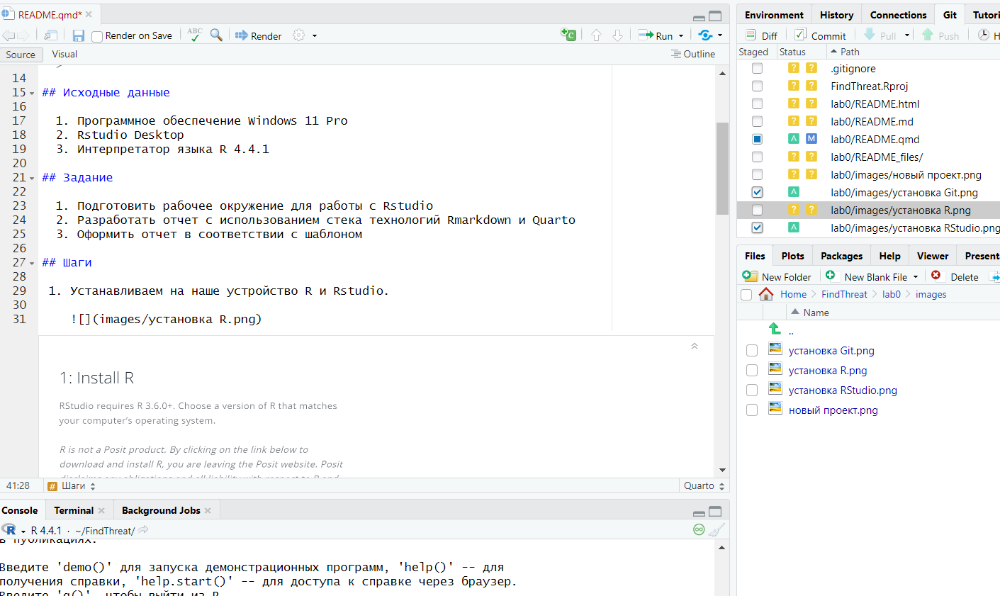
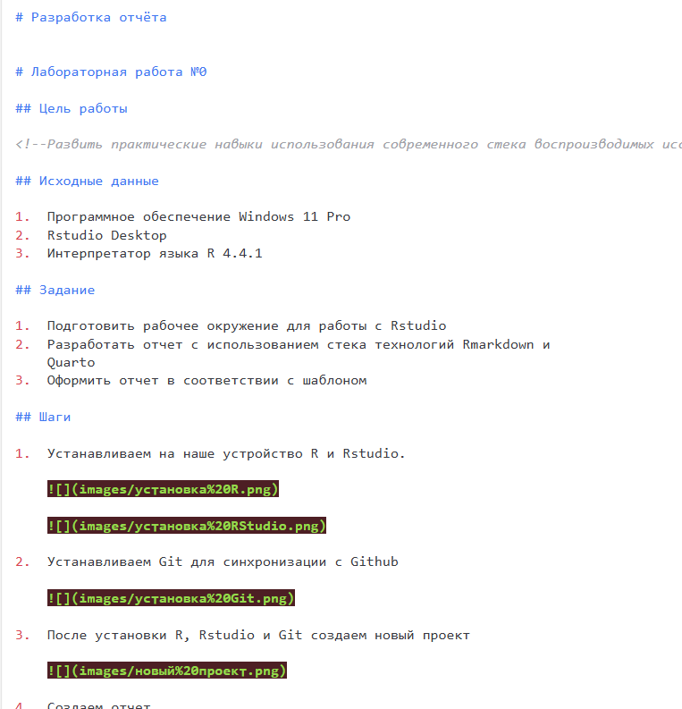
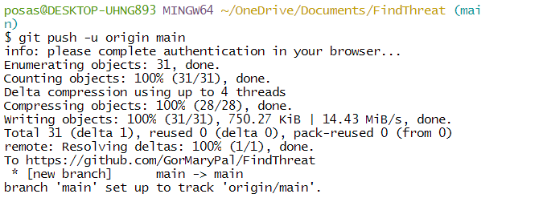

# Разработка отчёта

# Лабораторная работа №0

## Цель работы

<!--Развить практические навыки использования современного стека воспроизводимых исследований -->

## Исходные данные

1.  Программное обеспечение Windows 11 Pro
2.  Rstudio Desktop
3.  Интерпретатор языка R 4.4.1

## Задание

1.  Подготовить рабочее окружение для работы с Rstudio
2.  Разработать отчет с использованием стека технологий Rmarkdown и
    Quarto
3.  Оформить отчет в соответствии с шаблоном

## Шаги

1.  Устанавливаем на наше устройство R и Rstudio.

    

    

2.  Устанавливаем Git для синхронизации с Github

    

3.  После установки R, Rstudio и Git создаем новый проект

    

4.  Создаем отчет

    

5.  Рендерим его

    

6.  И пушим на Github

    

## Оценка результата

В результате работы было скачано всё необходимое ПО, создан репозиторий
на Github и отчет, который был загружен на него

## Вывод

Мы научились создавать и делать Quatro отчет в RStudio, а также
загружать оттуда работы на GitHub.
